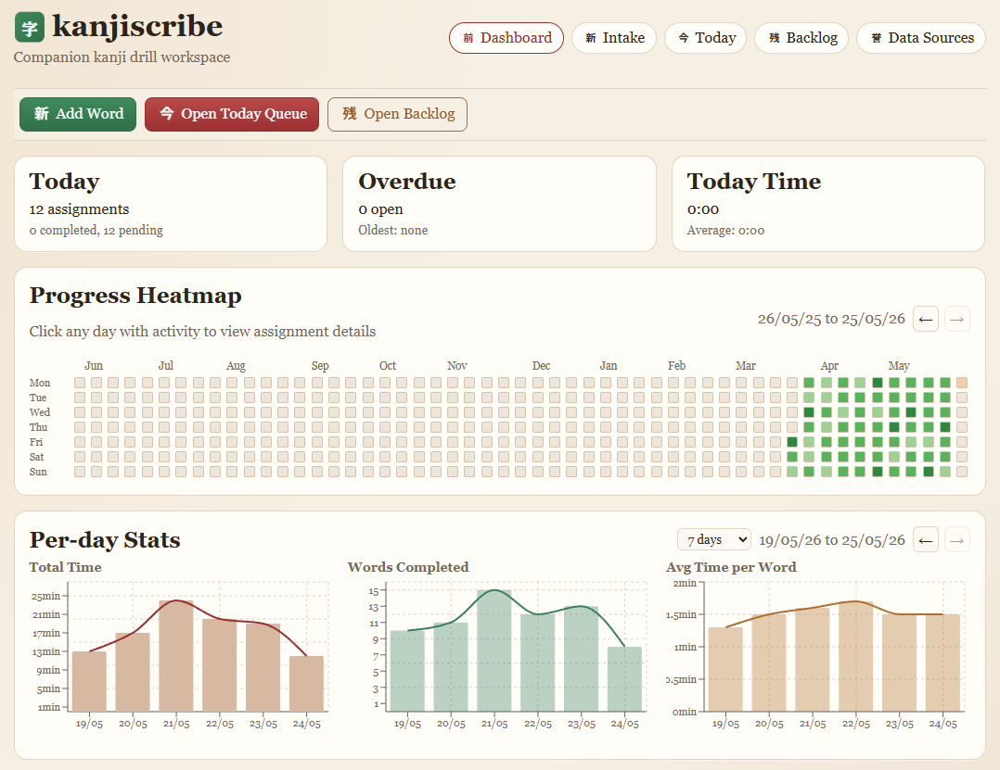
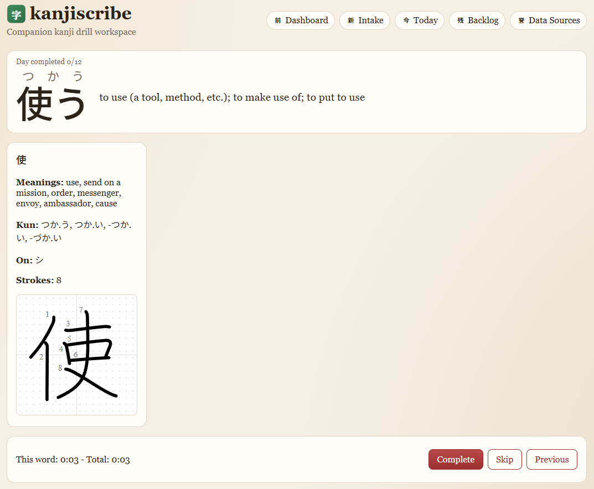

# kanjiscribe

<div align="center">
  <table>
    <tr>
      <td width="50%"></td>
      <td width="50%"></td>
    </tr>
  </table>
</div>

Private companion app to help facilitate practicing writing Japanese words from Anki workflows.

This application was primarily vibe-coded to fill a need of mine, I don't guarantee the quality of the code. You can follow the planning process I went through in [NOTES.md] which led to [PLAN.md](./PLAN.md) before starting implementation.

For context this application was created to run on a VPS/Raspberry Pi/home server setup accessed via Tailscale. It is not recommended for production use as-is.

## Stack

| Package | Tech | Purpose |
|---------|------|---------|
| `apps/api` | Fastify + better-sqlite3 + Drizzle ORM | REST API and SQLite database |
| `apps/web` | React 19 + Vite + React Router + Recharts | Frontend SPA |
| `packages/shared` | TypeScript + Zod | Shared schemas and enums |
| `packages/importer` | TypeScript + fast-xml-parser + sax + unzipper | CLI importer for JMdict / KANJIDIC2 / KanjiVG |

## Prerequisites

- **Node.js 22+** and **pnpm** (install globally with `corepack enable`)
- **Build tools** for native addons: `sudo apt install build-essential python3`
- **Dataset files** (see [Dataset Setup](#dataset-setup) below)

## Quick Start

```bash
pnpm install
pnpm --filter @kanjiscribe/api db:migrate
pnpm dev
```

- API runs on `http://localhost:3000`
- Web dev server runs on `http://localhost:5173`

The production server (built with `./scripts/build-prod.sh`) runs API and web together on a single port, serving the built SPA from `apps/web/dist/`.

## Native Dependency Build Approval

This workspace uses pnpm build approvals. `better-sqlite3` is pre-approved in `pnpm-workspace.yaml`, so new checkouts should be able to run `pnpm install` without manually running `pnpm approve-builds`.

If you still see native binding errors on a fresh machine:

```bash
pnpm approve-builds
pnpm install --force
```

Also commit `pnpm-lock.yaml` to keep native dependency versions consistent across environments.

## Dataset Setup

Download the reference datasets and place them in `resources/`:

- **JMdict** — `JMdict_e.gz` from [EDRDG](https://www.edrdg.org/wiki/index.php/JMdict-EDICT_Dictionary_Project)
- **KANJIDIC2** — `kanjidic2.xml.gz` from [EDRDG](https://www.edrdg.org/wiki/index.php/KANJIDIC2)
- **KanjiVG** — `kanjivg-*.zip` from [KanjiVG](https://kanjivg.tagaini.net/)

Import them into the database:

```bash
pnpm --filter @kanjiscribe/importer dev import:kanjidic2 resources/kanjidic2.xml.gz
pnpm --filter @kanjiscribe/importer dev import:jmdict resources/JMdict_e.gz
pnpm --filter @kanjiscribe/importer dev import:kanjivg resources/kanjivg-20250816-all.zip 2026-03
```

Environment variables for the importer:

| Variable | Default | Description |
|----------|---------|-------------|
| `DB_PATH` | `data/kanjiscribe.db` | SQLite database path |
| `KANJI_SVG_DIR` | `data/kanji-svg` | Output directory for KanjiVG SVG files |

Imports are safe to re-run — they use `INSERT OR REPLACE` / upsert semantics, so existing study data and assignments are preserved.

## Environment Variables

| Variable | Default | Description |
|----------|---------|-------------|
| `KANJISCRIBE_API_PORT` | `3000` (dev) / `52654` (prod) | Port the API/web server listens on |
| `KANJISCRIBE_API_HOST` | `127.0.0.1` (dev) / `0.0.0.0` (prod) | Address to bind to |
| `KANJISCRIBE_DATA_DIR` | `data/` relative to repo root | Sets both DB path and SVG dir at once |
| `KANJISCRIBE_DB_PATH` | `$DATA_DIR/kanjiscribe.db` | Override for database file path |
| `KANJI_SVG_DIR` | `$DATA_DIR/kanji-svg` | Override for KanjiVG SVG directory |

## Project Scripts

```bash
pnpm dev              # Start API + web dev servers concurrently
pnpm build            # Build all packages and apps
pnpm check            # Type-check all packages and apps
pnpm lint             # Lint all packages and apps
pnpm format           # Run Prettier across the repo
```

App-specific scripts:

```bash
pnpm --filter @kanjiscribe/api dev          # API dev server with hot reload
pnpm --filter @kanjiscribe/api build        # Bundle API with esbuild for production
pnpm --filter @kanjiscribe/api db:migrate   # Run SQL migrations manually

pnpm --filter @kanjiscribe/web dev          # Vite dev server
pnpm --filter @kanjiscribe/web build        # Build frontend for production

pnpm --filter @kanjiscribe/shared build     # Build shared package
pnpm --filter @kanjiscribe/importer dev     # Run importer CLI
```

## Implemented Features

- **Dictionary search** — search JMdict by spelling or reading with exact/prefix matching
- **Word detail view** — full entry with spellings, readings, senses, and reading restrictions
- **Intake** — manually add words, re-use existing study items, and create daily assignments
- **Today view** — see and manage assignments for the current day
- **Backlog view** — review pending and skipped assignments across all dates
- **Drill screen** — focused study mode with timer, complete, skip, and queue navigation
- **Word view** — read-only review of a completed or pending assignment with kanji breakdown
- **Day detail view** — drill into a specific date's assignments from the dashboard
- **Dashboard** — overview metrics, heatmap, top/slowest words, and top kanji statistics
- **Settings / Data Sources** — required dataset attribution and app metadata

## Database

SQLite with WAL mode enabled. Migrations run automatically on server boot (`CREATE TABLE IF NOT EXISTS` style). You do not need to run `db:migrate` manually in production — the server handles it.

On graceful shutdown the server runs `PRAGMA wal_checkpoint(TRUNCATE)` to flush the write-ahead log and remove `-wal`/`-shm` files.

## Deployment

For deploying Kanjiscribe as a production systemd service on a Raspberry Pi (or similar ARM64 Linux host), see the detailed deployment guide:

- **[Deployment Guide](docs/deployment.md)** — build, deploy, and run as a systemd service
- **[Updating Guide](docs/updating.md)** — update to a newer version, backup/restore, and rollback

## License

Dataset attribution is maintained in-app on the Data Sources page as per the requirements of the dataset licenses. No content derivative of the datasets is included in the content of the repository.

Kanjiscribe's license may be found [here](./LICENSE).
